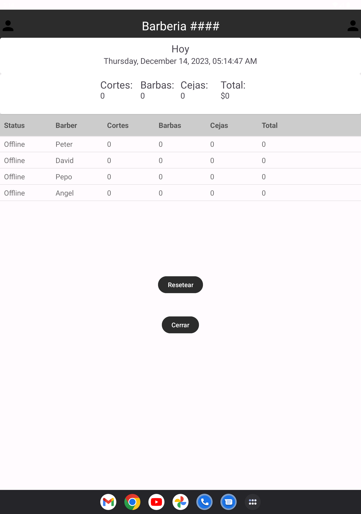
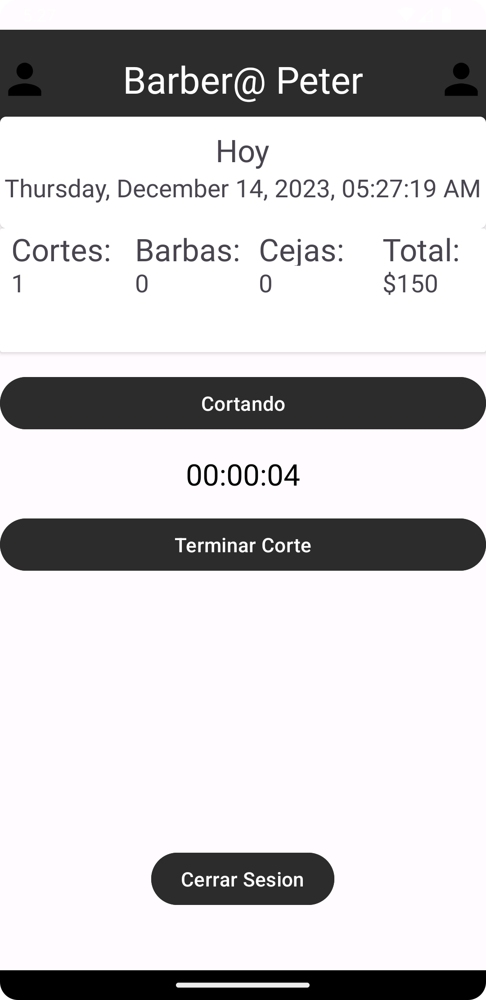
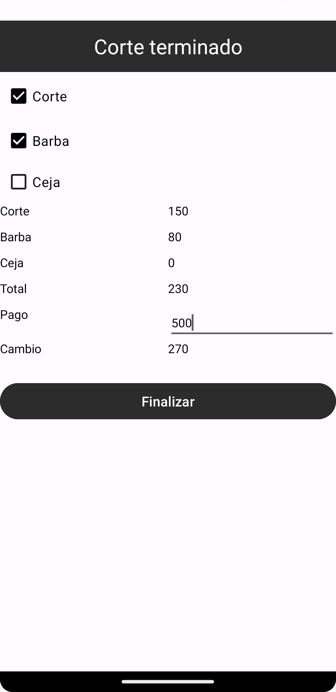
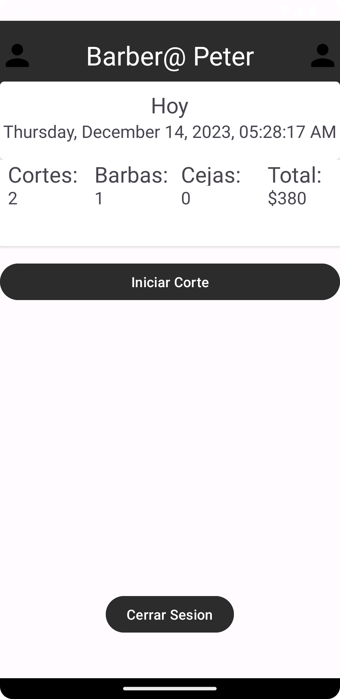

#  BarberManagement1

Manage your babershop by checking what your employees are doing, Active or inactive you will be able to remotly manage your buisness.

## Screenshots

# Admin (Owner of barbershop)

